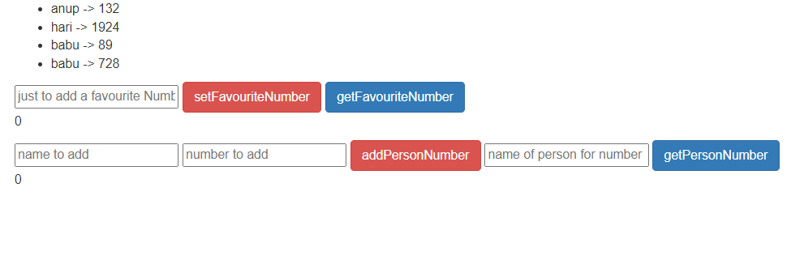

# Simple Storage

This is a simple storage replica of freecodecamp video on blockchain development.  
<strong>But I have added a twist with addition of a simple js integration for all the functionality provided with smart contract and also I have created a test file</strong>

## Tools used

-   Truffle
-   Ganache
-   chai/mocha for testing provided default with truffle
-   created on template of pet-shop by truffle
-   jquery
-   solidity
